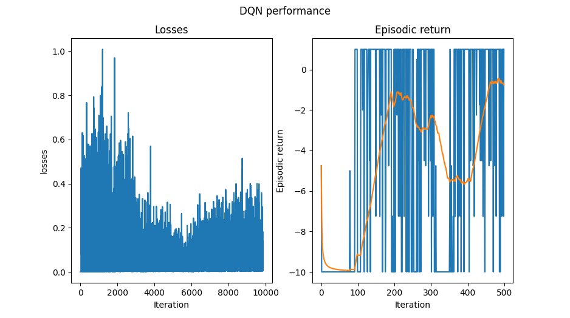
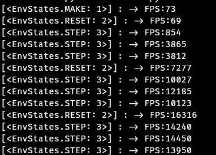

# OroloEnv
<p align="center">
   
</p>
OroloEnv is a reaserch project developed to test some ideas I had for a Reinforcement Learning environement suite. **Simulators that are constrained by moore's law**!
If you add more CPU cores to your simulator and your training time doesn't improve (drastically) then you are doing something right. Secondly, the approach of 'using' JAX
to achieve this, misses the point. JAX is not a magical compiler that makes our code faster, but it is wonderful!
 
**Simulators that are constrained by moore's law** are what we shall call hardware-accelerated simulators. So how will we go about creating our hardware-accelerated simulators?
1) First we need a way track the performance of our games. I propose **frames per second (FPS)**
   - If you can get a first person shooter to play over 60fps on your CPU (whilst listerning to your favorite song, then there is no reason your environment shouldn't
     otherwise you should just train on your game first person shoooter instead.
2) For now, I wish to constrain this project to Combinatorial optimization games. No subjective reason
3) Avoid the need for JAX or Numpy in the core library. games/environments are free to be designed with whatever tools that are required. 
1) I want to treat all our games as vectorized environements (specifically Asynchronous) and find out what happens. lets use all our (CPU) cores!!


## What does this mean for a game developer?
For now, if you wish to add support for your game, you need to 'define' your game to run like any Gym environment. 
```python
class YourGame name:
  def __init__(self,env: Env): 
    self.env = env
    
  @classmethod
  def make(cls, env): 
    return cls(env)
  def compute(self): 
    return self.env
    
  def step(self, *action, **kwargs): 
    raise NotImplementedError(f"step() is not implementd for {self}")
    
  def reset(self, *args, **kwargs): 
    raise NotImplementedError(f"reset() is not implementd for {self}")
    
  def render(self, *args, **kwargs) 
    raise NotImplementedError(f"render() is not implementd for {self}")
    
  def close(self, *args, **kwargs) 
    raise NotImplementedError(f"close() is not implementd for {self}")

```

And then just call it in orolo.make() and the library should do the reset.
```python
if __name__=='__main__':

  import random
  DEBUG = True
  seed = 1337
  num_env = 4
  envs = oroloEnv.make([YourGame() for _ in range(num_env)], device='async')

  for episode  in range(500):
    obs = envs.reset(seed=random.randint(0,999)).compute()
    done = False
    while not done :
      action = random.randint(0,9)
      obss,rews, dones = envs.step(action=[random.randint(0,9) for _ in range(num_env)]).compute()
      if True in dones:
        break
```
## Future work
Please note, these are just ideas born out of too much coffee one weekend. Development will be slow and my ideas might change.

#### Current state 
The below image shows DQN's performance on the game TicTacToe on this system.
<p align="center">
   
   
</p>

## Similar work 
These great tools have are also trying to create hardware-accelerated simulators/suites but follow different philosophies from us.

There is a growing number of researchers working on hardware-accelerated simulators/suites. They follow different philosophies from me but have inspired
the development of this project, here is a list of related efforts:

* [Jumanji](https://github.com/instadeepai/jumanji): A suite of diverse and challenging RL environments in JAX.
* [envpool](https://github.com/sail-sg/envpool): Vectorized parallel environment execution engine.
* [Brax](https://github.com/google/brax): JAX-based library for rigid body physics by Google Brain with JAX-style MuJoCo substitutes.
* [Pgx](https://github.com/sotetsuk/pgx): JAX-based classic board game environments.
* [gymnax](https://github.com/RobertTLange/gymnax/blob/main/README.md): AX-based Reinforcement Learning Environment Library


### Citing
If you use `oroloEnv` in your research, please cite it as follows:
```
@software{urela2022github,
  author = {urela},
  title = {{OroloEnv},
  url = {http://github.com/Urela/OroloEnv},
  version = {0.0.2},
  year = {2023},
}

```
###
Thanks to DinosoftLabs for their icon
